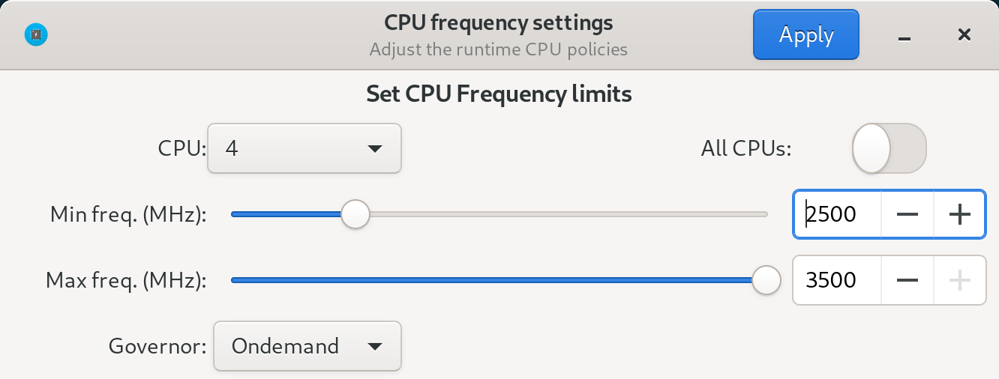

cpupower-gui
--------------------

This program is designed to allow you to change the frequency limits of your cpu and its governor. The application is similar in functionality to `cpupower`.

# Dependencies
Build:
`pkg-config`, `autoconf-archive`, `git`, `autoconf`, `make`

Runtime:
`python3`, `dbus`, `python3-dbus`, `gtk3`, `hicolor-icon-theme`, `polkit`

# Manual Instalation
## Install
To install this program do the following:

- Install missing dependencies
- Clone the repository
- Change directory to the cloned repo
- Open a terminal in that directory and run `./autogen.sh --prefix=/usr` followed by `make && make install`.

## Uninstall

To uninstall simply run `make uninstall`.

# Packages
Prebuilt packages for Arch exist in releases. Also, there is a package in AUR [`cpupower-gui-git`](https://aur.archlinux.org/packages/cpupower-gui-git/), built from this repo.

# Screenshot

