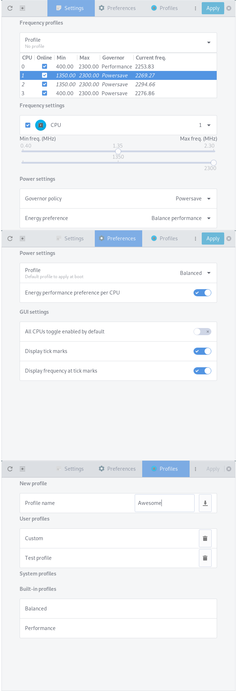
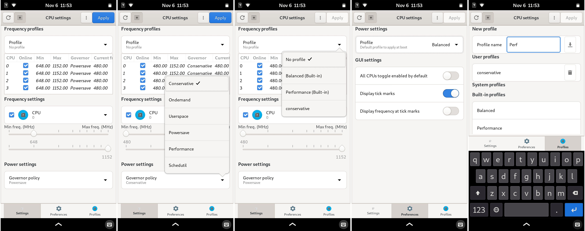

cpupower-gui
--------------------
This program is designed to allow you to change the frequency limits of your cpu and its governor. The application is similar in functionality to `cpupower`.

[](https://GitHub.com/vagnum08/cpupower-gui/releases/)
[](https://repology.org/project/cpupower-gui/versions)
[](https://github.com/vagnum08/cpupower-gui/blob/master/COPYING)
[](https://github.com/vagnum08/cpupower-gui/archive/master.zip)
[](https://GitHub.com/vagnum08/cpupower-gui/releases/)

# Screenshots

If Intel P-state driver is used and the energy preferences are available a drop-down will be available.


`cpupower-gui` is also mobile friendly and will adapt the interface based on the window size.
Below is an example from [pinephone](https://www.pine64.org/pinephone/) with phosh running on [mobian](https://mobian-project.org/).



# Packages
Cpupower-gui is available on the official repositories for a few distributions.

[](https://repology.org/metapackage/cpupower-gui/versions)

Prebuilt binary packages (latest repo version) for Arch, Debian/Rasbian, Fedora, and Ubuntu are available on  [openSUSE Build Service](https://software.opensuse.org/download.html?project=home%3Aerigas%3Acpupower-gui&package=cpupower-gui)

## Repositories:

### Arch Linux and derivatives
Packages exist in AUR as [`cpupower-gui`](https://aur.archlinux.org/packages/cpupower-gui/) ([`cpupower-gui-git`](https://aur.archlinux.org/packages/cpupower-gui-git/)), built from this repo.

### blackPanther OS
To install `cpupower-gui` run `updating repos` to update the repositories and install by running `installing cpupower-gui`.

### Debian/Ubuntu and derivatives
You can install `cpupower-gui` from the software manager or from the terminal by running:
```bash
sudo apt install cpupower-gui
```

To get the latest version either grab the debian packages from OpenSUSE build service or add the repository to your system.
For example, in xUbuntu 20.04 run the following:
```
echo 'deb http://download.opensuse.org/repositories/home:/erigas:/cpupower-gui/xUbuntu_20.04/ /' | sudo tee /etc/apt/sources.list.d/home:erigas:cpupower-gui.list
curl -fsSL https://download.opensuse.org/repositories/home:erigas:cpupower-gui/xUbuntu_20.04/Release.key | gpg --dearmor | sudo tee /etc/apt/trusted.gpg.d/home:erigas:cpupower-gui.gpg > /dev/null
sudo apt update
sudo apt install cpupower-gui
```

### Fedora
You can install `cpupower-gui` by adding the repository from OpenSUSE build service.
For example, in Fedora 32 run the following as root:
```bash
dnf config-manager --add-repo https://download.opensuse.org/repositories/home:erigas:cpupower-gui/Fedora_32/home:erigas:cpupower-gui.repo
dnf install cpupower-gui
```

### OpenMandriva
You can install `cpupower-gui` from the offical repository.
```bash
dnf install cpupower-gui
```


# Usage
## Graphical

To change the frequency settings, select the CPU from the drop-down menu, adjust the sliders and click `Apply`.
Additionally, the cpu governor can be changed by selecting a governor from the drop-down menu.
Last, to apply the same settings to all CPUs, toggle the `All CPUs` switch (square icon on the top left).

There are two governor profiles available, `Performance` and `Balanced`.
The performance profile sets the governor for all CPUs to `performance`.
Similarly, the balanced profile set the governor to either `powersave` (if available) or to a scalling governor such as `ondemand` or `schedutil`.

These profiles can be selected either from the desktop icon or the tray icon actions.

There is an option to enable or disable a specific cpu.
This can be controlled via the the `Online` checkbox next to the `CPU` drop-down menu.
Initially, the checkbox displays the state of the cpu, i.e. if it is online or offline.

Note: If this checkbox is greyed-out, it means that this cpu is not allowed to go offline.

## Command-line

The governor profiles can be used from the command line.

```
$ cpupower-gui -h

usage: cpupower-gui [-h] [--version] [-l] [--apply-config]
                    [--apply-profile PROFILE] [-b] [-p]
                    [--gapplication-service]
                    [--energy-performance-preference {default,performance,balance_performance,balance_power,power}]
                    [--list-energy-preferences [LIST OF CPUS]]

cpupower-gui - Set the scaling frequencies and governor of a CPU

optional arguments:
  -h, --help            show this help message and exit
  --version             show program's version number and exit
  -l, --list-profiles   List available cpupower profiles
  --apply-config        Apply cpupower configuration
  --apply-profile PROFILE
                        Apply a cpupower profile
  -b, --balanced        Change governor to balanced
  -p, --performance     Change governor to performance
  --gapplication-service
                        Start gui from gapplication
  --energy-performance-preference {default,performance,balance_performance,balance_power,power}
                        Set a global energy profile
  --list-energy-preferences [LIST OF CPUS]
                        List available energy performance preferences
                        (Default: all cpus)

```

For example to switch all governors to performance run `cpupower-gui -p`.
Alternatively, the application actions can be executed via `gapplication`.

```bash
# Switch to balanced profile
gapplication action org.rnd2.cpupower_gui Balanced

# Switch to performance profile
gapplication action org.rnd2.cpupower_gui Performance

```

### Profiles and configuration
Since version `0.9.0` the command line supports setting the CPUs based on a configuration file and setting user-defined profiles.

To apply the default configuration just run `cpupower-gui --apply-config`.
To apply a profile run `cpupower-gui --apply-profile Performance`.
If the name of the profile contains spaces use quotes, e.g. `cpupower-gui --apply-profile "Custom profile"`.

### Intel P-State energy performance preferences
The last two options (`energy-performance-preference`, `list-energy-preferences`) are only available
on Intel systems that use the `intel_pstate` driver.

The `energy-performance-preference` option changes the preference to one of the available preferences for all CPUs.


The `list-energy-preferences` option accepts a list of CPUs writen in the following format.
Comma separated values for listing CPU and hyphen for specifying a range.
For example `0-3` and `0,2-5,8` become `0,1,2,3` and `0,2,3,4,5,8` respectively.

If no value is passed it will report the preferences for all available cpus.
The current preference is indicated inside the parentheses.

```
$ cpupower-gui --list-energy-preferences 0-3
The available energy performance preferences are:
CPU 0:
	- default
	- performance
	- balance_performance (Current)
	- balance_power
	- power
CPU 1:
	- default
	- performance
	- balance_performance (Current)
	- balance_power
	- power
CPU 2:
	- default
	- performance
	- balance_performance (Current)
	- balance_power
	- power
CPU 3:
	- default
	- performance
	- balance_performance (Current)
	- balance_power
	- power
```


# System configuration and User profiles
## System configuration

Since version `0.9.0`, `cpupower-gui` can be configured using configuration files. The system configuration file is located in `/etc/cpupower_gui.conf`.
Users can add `.conf` files in `/etc/cpupower_gui.d` to override the default behaviour. The settings in these files override the behaviour of `cpupower-gui` system-wide.

Alternatively, users can add their configuration in `~/.config/cpupower_gui/`. The settings defined in that location take precedence over the ones defined in `/etc/`.

Currently, the only available settings are:
- `profile` under the `Profile` section,

and under the `GUI` section,
- `allcpus_default`
- `tick_marks_enabled`
- `frequency_ticks`
- `energy_pref_per_cpu`

Specifically,

- `profile` option sets the name of the profile to use when using `--apply-config` option (Default: Balanced).
 - `allcpus_default` option controls the default state of the `To All CPUs` toggle of the GUI (Default: False).
- `tick_marks_enabled` option controls if tick marks should be displayed on the sliders (Default: True).
- `frequency_ticks` option controls if frequency is displayed above the tick marks (Default: True).
- `energy_pref_per_cpu` option allows you to select different energy profiles per CPU (Default: False).


## User profiles

User profiles are text files with a `.profile` suffix. These files should be placed either in `/etc/cpupower_gui.d/` or `~/.config/cpupower_gui/`.
Profiles placed in `/etc/cpupower_gui.d/` are then available to all users.

An [example profile](data/cpupower_gui.d/my_profile.profile.ex) is available at `/etc/cpupower_gui.d/my_profile.profile.ex`.
For more information about the profile format see [here](data/cpupower_gui.d/README).

By default, there are two auto-generated profiles named `Balanced` and `Performance`.


## systemd units

Since version 0.9.0, two systemd units have been added; a "system" and a "user" one.

The `cpupower-gui.service` applies the configuration as defined in `/etc/cpupower_gui.conf` during boot.
The `cpupower-gui-user.service` applies the user configuration during login (see notes below).

In a single-user environment the system service is preferable.

In a multi-user environment, the user service gives each user the ability to customise the profiles based on their needs.
When the user logs into the system, their settings will automatically apply.

Notes:
- The `cpupower-gui-user.service` currently depends on `graphical.target`. This is tested and works with Gnome Shell. If it doesn't work on a different display manager, open an issue.
- To apply the settings during login the user must be active and local to the system. This means that the user must have access to the hardware, so it won't work when the user logs in through `ssh`.
- To apply the settings over `ssh` the user will need root access.

## Enabling extra governors
By default, `cpupower-gui` will only show the available governors for each cpu.
To enable additional governors, such as `conservative` or `userspace`, copy the `scaling-governors.conf` file over to `/etc/modules-load.d`.
This way the new governors will be available across reboots.


# Manual Installation
This package uses the [Meson build system](https://mesonbuild.com/) for build configuration and [Ninja](https://ninja-build.org/) as the backend build system.

## Clone the repository

```bash
git clone https://github.com/vagnum08/cpupower-gui.git
cd cpupower-gui
```

## Install build dependencies
The main build depencies are `meson (>=0.50.0)`, `ninja`, `glib2.0`, and `pkg-config`.

To install them,

- On Arch and derivatives: `pacman -Sy pkg-config meson`
- On blackPanther OS and derivatives: (TBD)
- On Debian and derivatives: `apt update && apt install  meson ninja-build pkg-config libglib2.0-bin libglib2.0-dev`
- On Fedora: `dnf install meson gettext pkg-config glib2-devel`
- On openSUSE Tumbleweed: `zypper install meson gettext-tools`

Optionally (for meson check) the following programs are needed:  `desktop-file-validate`, `appstream-util`, `glib-compile-schemas`.

To install them,

- On Arch and derivatives: `pacman -Sy desktop-file-utils appstream-glib`
- On blackPanther OS and derivatives: (TBD)
- On Debian and derivatives: `apt update && apt install appstream-util desktop-file-utils`
- On openSUSE Tumbleweed: `zypper install glib2-devel`

## Build cpupower-gui
```bash
meson build --prefix /usr -Dsystemddir=<path-to-systemd-dir> -Dpkla=<true|false> -Duse_libexec=<true|false>
ninja -C build
```

### Meson options

#### `-Dsystemddir`

The `systemddir` option should point to the systemd directory.
If this option is not set the default is used (i.e. `/usr/lib/systemd`).

- The default value is valid for Arch/Fedora/OpenSUSE and derivatives.
- For Debian and Ubuntu based systems you should use `-Dsystemddir=/lib/systemd`.
##### `-Dpkla`
Since version **`0.9.0`** an additional option (**`-Dpkla`**) has been added for PolicyKit rules.
This option is set to **`false`** by default.

When `pkla` is set to `false` a polkit `.rules` file is installed under `/usr/share/polkit-1/rules.d/`.
When `pkla` is set to `true` a `.pkla` file is installed under `/var/lib/polkit-1/localauthority/10-vendor.d/`.

- The default value works Arch/Fedora/NixOS/OpenSUSE and derivatives.
- For Debian and Ubuntu based systems you should use `-Dpkla=true`

##### `-Duse_libexec`
Since version **`1.0.0`** an additional option (**`-Duse_libexec`**) has been added.
This option is set to **`false`** by default.

When `use_libexec` is set to `false` the helper program is installed under `/usr/lib/`.
When `use_libexec` is set to `true` the helper program is installed under `/usr/libexec/`.

- The default value works Arch/Fedora/NixOS/OpenSUSE and derivatives.
- For Debian and Ubuntu based systems you should use `-Duse_libexec=true`

## Install
To install run `ninja -C build install`

## Uninstall

To uninstall run `ninja -C build uninstall`.

# Runtime Dependencies
### Note:
Since version 0.7.1, Python GObject version must be >= 3.30

## Arch Linux and derivatives
`python` `gtk3` `hicolor-icon-theme` `polkit` `python-dbus` `python-gobject` `libappindicator-gtk3` `python-pyxdg` `libhandy`

## blackPanther OS and derivatives
`python3`, `gtk3`, `hicolor-icon-theme`, `polkit`, `python3-dbus`, `python3-gobject3` `gir1.2-handy-1` `xdg`

## Debian and derivatives
`libgtk-3-0` `gir1.2-gtk-3.0` `hicolor-icon-theme` `policykit-1` `python3-dbus` `python3-gi` `python3-xdg` `gir1.2-handy-1`

Suggested for authentication dialogue: `policykit-1-gnome` or `mate-polkit` or `lxpolkit`

For the tray icon `gir1.2-appindicator3-0.1`.

## Fedora and openSUSE
### Fedora only
`gtk3` `python3-dbus` `python3-gobject` `libhandy-1`

### openSUSE only
`libgtk-3-0` `typelib-1_0-Gtk-3_0` `python3-gobject` `python3-gobject-Gdk` `python3-dbus-python` `typelib-1_0-Handy-1`

## Common
 `hicolor-icon-theme` `python3-pyxdg`

A polkit agent such as `mate-polkit`, `polkit-kde-agent-5`, `policykit-1-gnome`, etc.
For reading/writing configuration from/to user's home directory: [`xdg`](https://repology.org/project/python:pyxdg/versions)
