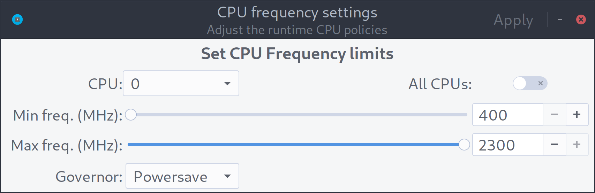
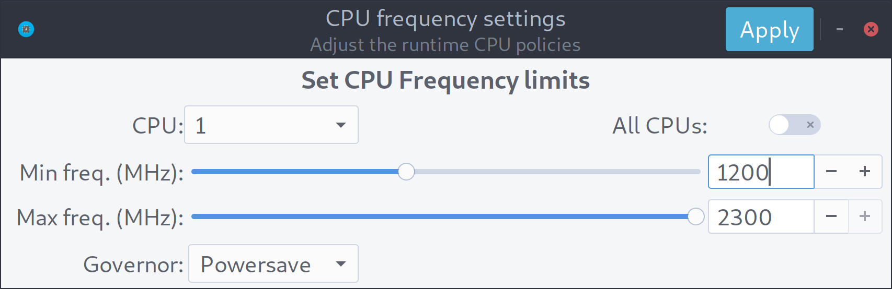
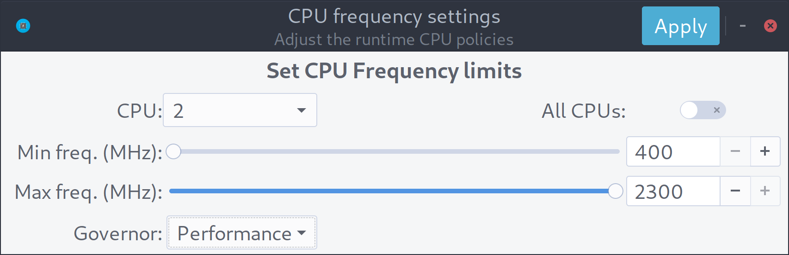

cpupower-gui
--------------------
This program is designed to allow you to change the frequency limits of your cpu and its governor. The application is similar in functionality to `cpupower`.

[](https://GitHub.com/vagnum08/cpupower-gui/releases/)
[](https://repology.org/project/cpupower-gui/versions)
[](https://github.com/vagnum08/cpupower-gui/blob/master/COPYING)
[](https://github.com/vagnum08/cpupower-gui/archive/master.zip)
[](https://GitHub.com/vagnum08/cpupower-gui/releases/)

# Screenshots
The theme used is [Arc-Darker](https://github.com/horst3180/arc-theme).

  

# Packages
Cpupower-gui is available on the official repositories for a few distributions.

[](https://repology.org/metapackage/cpupower-gui/versions)

Prebuilt binary packages for Arch, Debian/Rasbian, Fedora, and Ubuntu are available on [openSUSE Build Service](https://software.opensuse.org/download.html?project=home%3Aerigas%3Acpupower-gui&package=cpupower-gui)

## Repositories:

### Arch Linux and derivatives
Packages exist in AUR as [`cpupower-gui`](https://aur.archlinux.org/packages/cpupower-gui/) ([`cpupower-gui-git`](https://aur.archlinux.org/packages/cpupower-gui-git/)), built from this repo.

### blackPanther OS 
To install `cpupower-gui` run `updating repos` to update the repositories and install by running `installing cpupower-gui`.


# Usage
## Graphical

To change the frequency settings, select the CPU from the drop-down menu, adjust the sliders and click `Apply`.
Additionally, the cpu governor can be changed by selecting a governor from the drop-down menu.
Last, to apply the same settings to all CPUs, toggle the `All CPUs` switch.

There are two governor profiles available, `Performance` and `Balanced`.
The performance profile sets the governor for all CPUs to `performance`.
Similarly, the balanced profile set the governor to either `powersave` (if available) or to a scalling governor such as `ondemand` or `schedutil`.

These profiles can be selected either from the desktop icon or the tray icon actions.

There is an option to enable or disable a specific cpu.
This can be controlled via the the `Online` checkbox next to the `CPU` drop-down menu.
Initially, the checkbox displays the state of the cpu, i.e. if it is online or offline.

Note: If this checkbox is greyed-out, it means that this cpu is not allowed to go offline.

## Command-line

The governor profiles can be used from the command line.

```bash
$ cpupower-gui -h

Usage:
  cpupower-gui [OPTION…]

Help Options:
  -h, --help                 Show help options
  --help-all                 Show all help options
  --help-gapplication        Show GApplication options
  --help-gtk                 Show GTK+ Options

Application Options:
  -p, --performance          Change governor to performance
  -b, --balanced             Change governor to balanced
  --display=DISPLAY          X display to use

```

For example to switch all governors to performance run `cpupower-gui -p`.
Alternatively, the application actions can be executed via `gapplication`.

```bash
# Switch to balanced profile
gapplication action org.rnd2.cpupower_gui Balanced

# Switch to performance profile
gapplication action org.rnd2.cpupower_gui Performance

```

# Manual Installation
This package uses the [Meson build system](https://mesonbuild.com/) for build configuration and [Ninja](https://ninja-build.org/) as the backend build system.

## Clone the repository

```bash
git clone https://github.com/vagnum08/cpupower-gui.git
cd cpupower-gui
```

## Install build dependencies
The main build depencies are `meson (>=0.50.0)`, `ninja`, `glib2.0`, and `pkg-config`.

To install them,

- On Arch and derivatives: `pacman -Sy pkg-config meson`
- On blackPanther OS and derivatives: (TBD)
- On Debian and derivatives: `apt update && apt install  meson ninja-build, pkg-config, libglib2.0-bin, libglib2.0-dev`
- On Fedora: `dnf install meson gettext pkg-config glib2-devel`
- On openSUSE Tumbleweed: `zypper install meson gettext-tools`

Optionally (for meson check) the following programs are needed:  `desktop-file-validate`, `appstream-util`, `glib-compile-schemas`.

To install them,

- On Arch and derivatives: `pacman -Sy desktop-file-utils appstream-glib`
- On blackPanther OS and derivatives: (TBD)
- On Debian and derivatives: `apt update && apt install appstream-util desktop-file-utils`
- On openSUSE Tumbleweed: `zypper install glib2-devel`

## Build cpupower-gui
```bash
meson build --prefix /usr -Dsystemddir=<path-to-systemd-dir>
ninja -C build
```

The `systemddir` option should point to the systemd directory.
If this option is not set the default is used (i.e. `/usr/lib/systemd`).

- The default value is valid for Arch/Fedora/OpenSUSE and derivatives.
- For Debian and Ubuntu based systems you should use `-Dsystemddir=/lib/systemd`.

## Install
To uninstall run `ninja -C build install`

## Uninstall

To uninstall run `ninja -C build uninstall`.

# Runtime Dependencies
### Note:
Since version 0.7.1, Python GObject version must be >= 3.30

## Arch Linux and derivatives
`python` `gtk3` `hicolor-icon-theme` `polkit` `python-dbus` `python-gobject` `libappindicator-gtk3`

## blackPanther OS and derivatives
`python3`, `gtk3`, `hicolor-icon-theme`, `polkit`, `python3-dbus`, `python3-gobject3`

## Debian and derivatives
`libgtk-3-0` `gir1.2-gtk-3.0` `hicolor-icon-theme` `policykit-1` `python3-dbus` `python3-gi`

Suggested for authentication dialogue: `policykit-1-gnome` or `mate-polkit` or `lxpolkit`
For the tray icon `gir1.2-appindicator3-0.1`.

## Fedora and openSUSE
### Fedora only
`gtk3` `python3-dbus` `python3-gobject`

### openSUSE only
`libgtk-3-0` `typelib-1_0-Gtk-3_0` `python3-gobject` `python3-gobject-Gdk` `python3-dbus-python`

### Common
 `hicolor-icon-theme`

A polkit agent such as `mate-polkit`, `polkit-kde-agent-5`, `policykit-1-gnome`, etc.
